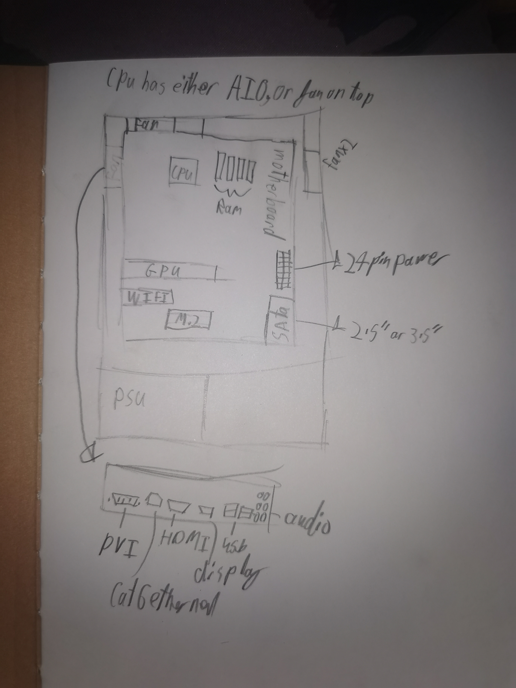

# Lesson 1

## Drawing of a computer

A computer drawing, based of my knowledge of my own PC.
I show a PC case open from the left side, with a CPU, GPU, WiFi Card, RAM, PSU, Fans, M.2 Drive, and SATA drive inserted. footnotes provided for description of the CPU cooling and different size SATA Drives.
At the bottom a rough I/O shield based off of the ASUS B450 Steel Legend Motherboard.

Date - 2021-08-24

